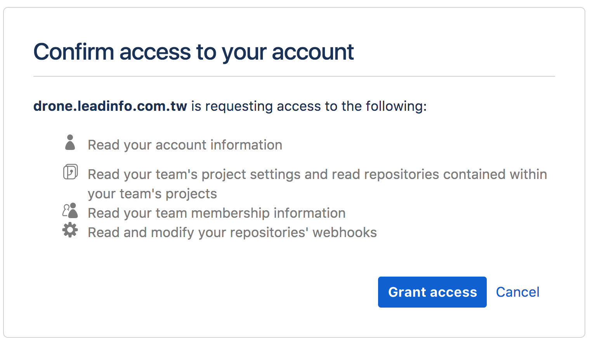

# Install Drone with Bitbucket

## How to register OAuth application

Go to your account setting in bitbucket, click `OAuth` under `ACCESS MANAGEMENT` menu on left sidebar and click `Add consumer` under `OAuth consumers`.

You will see the following register page.

Please make sure that your drone `Callback URL` setting. It is very import the authorization callback URL matches your http(s) scheme and hostname exactly with **/authorize** (0.8) **/login** (1.0) as the path.

Check the following OAuth Permissions

Copy `Key` and `Secret` in `OAuth consumers`

Open your drone home page in your browser and login as BitBucket account.

