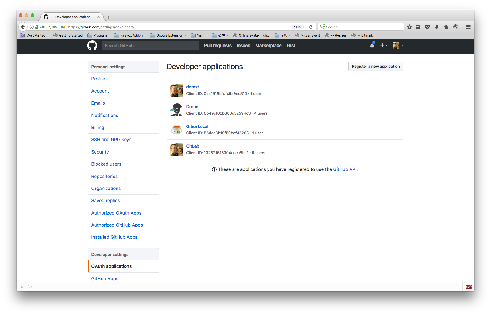
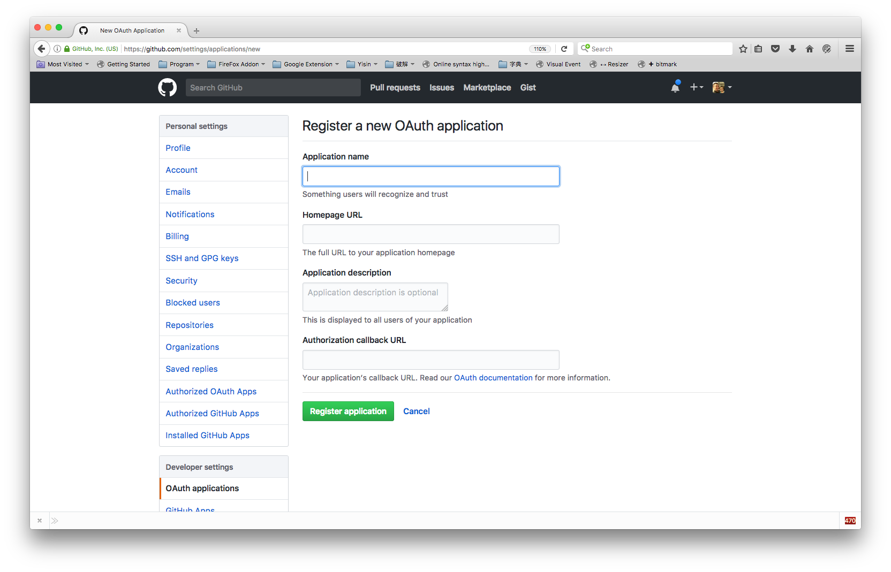
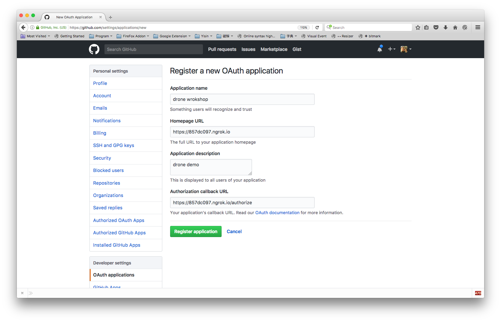
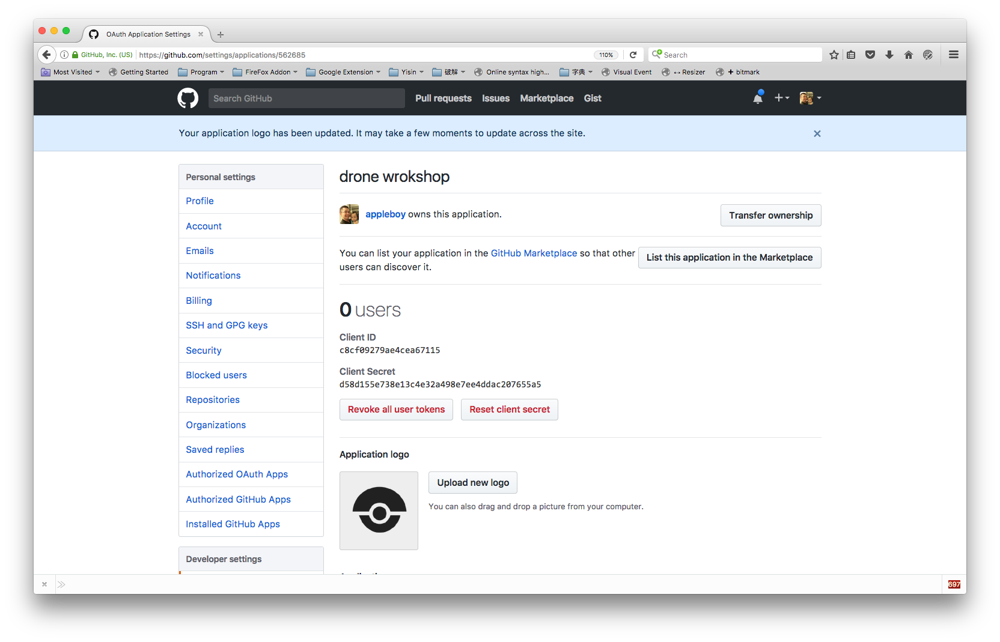
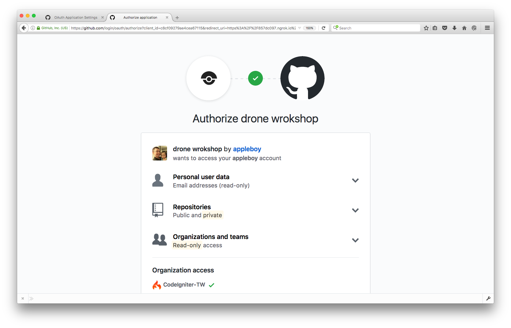

# Install Drone with GitHub

See the online documentaion: [Single Machine](https://docs.drone.io/installation/github/single-machine/) | [Multi-Machine](https://docs.drone.io/installation/github/multi-machine/) | [Kubernetes](https://docs.drone.io/installation/github/kubernetes/)

## How to register OAuth application

Go to your GiHub [profile setting](https://github.com/settings/profile) and click `OAuth applications` under `Developer settings` menu on left sidebar.

You will see the following register page.

Please make sure that your drone `Authorization callback URL` setting. It is very import the authorization callback URL matches your http(s) scheme and hostname exactly with **/authorize** (0.8) **/login** (1.0) as the path.

>

Copy `Client ID` and `Client Secret`

Open your drone home page in your browser and login as Github account.

