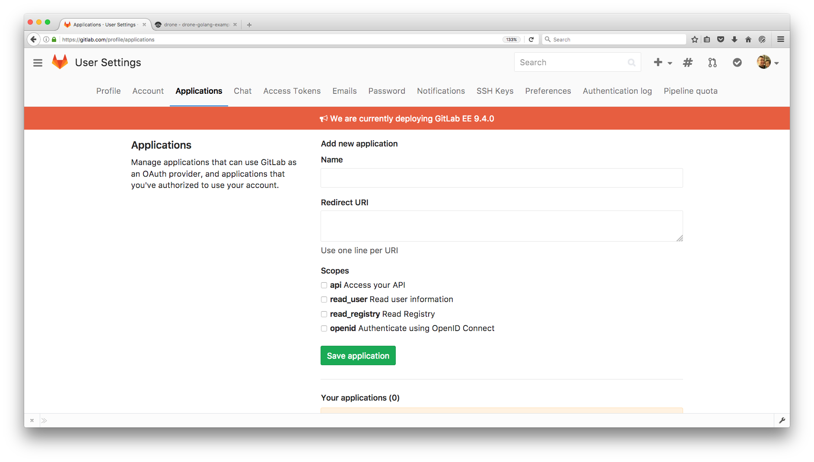
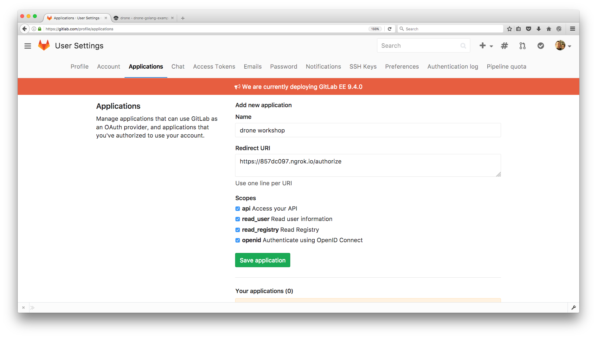
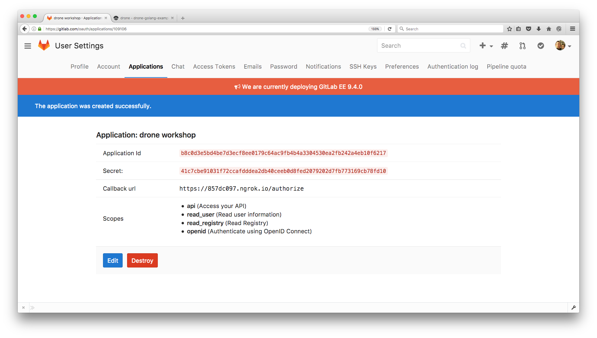
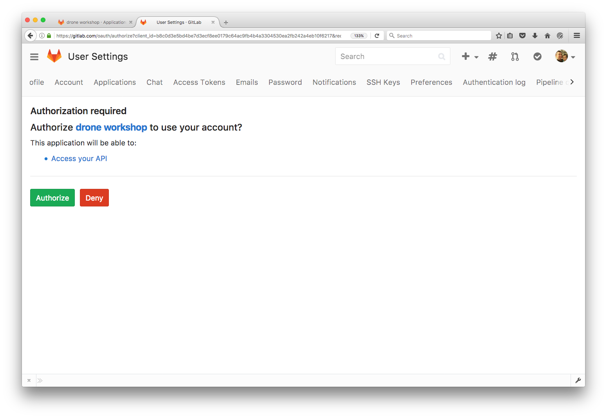

# Install Drone with GitLab

## How to register OAuth application

Go to your GitLab [profile setting](https://gitlab.com/profile) and navigate to your account settings and choose `Applications` from the menu.

Please make sure that your drone `Authorization callback URL` setting. It is very import the authorization callback URL matches your http(s) scheme and hostname exactly with **/authorize** as the path.

Copy `Application ID` and `Secret`

Open your drone home page in your browser and login as gitlab account.

